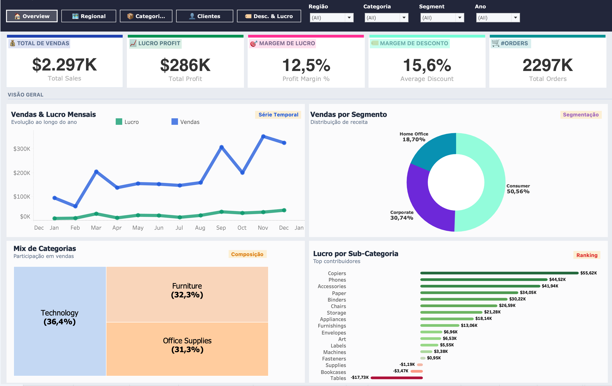
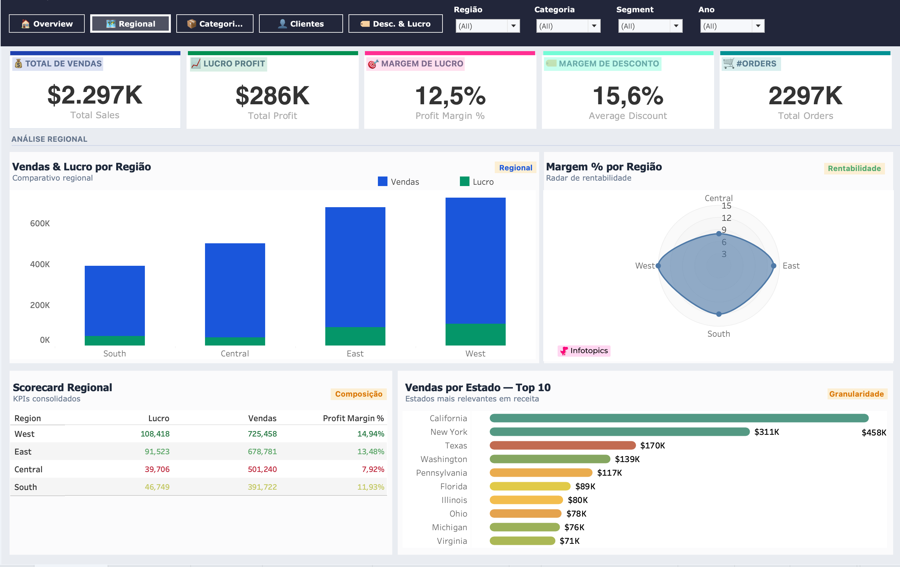
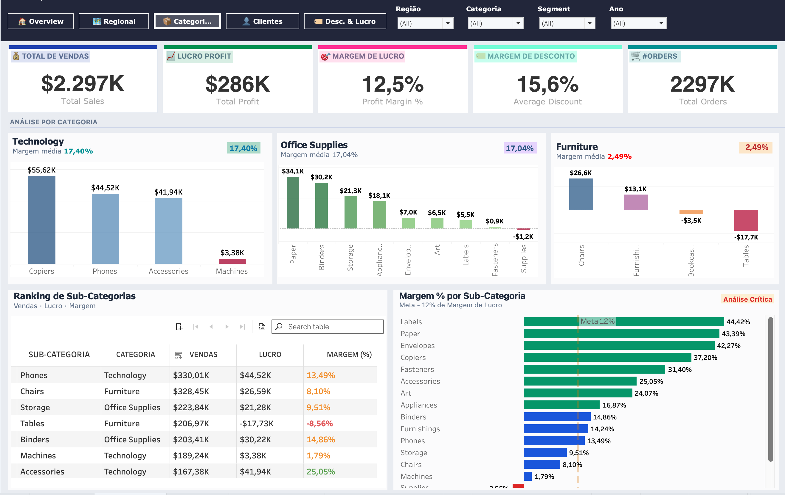
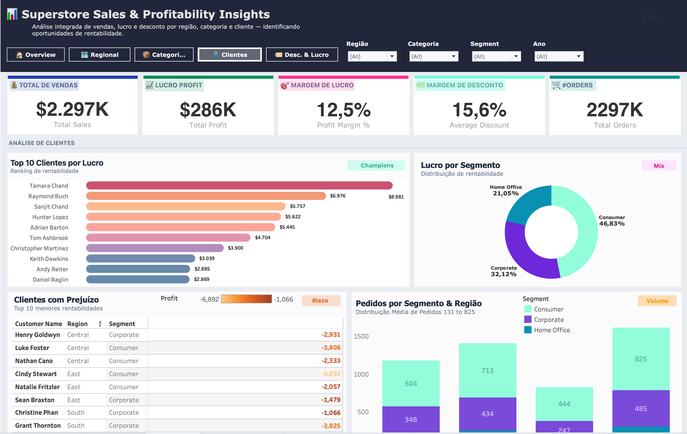
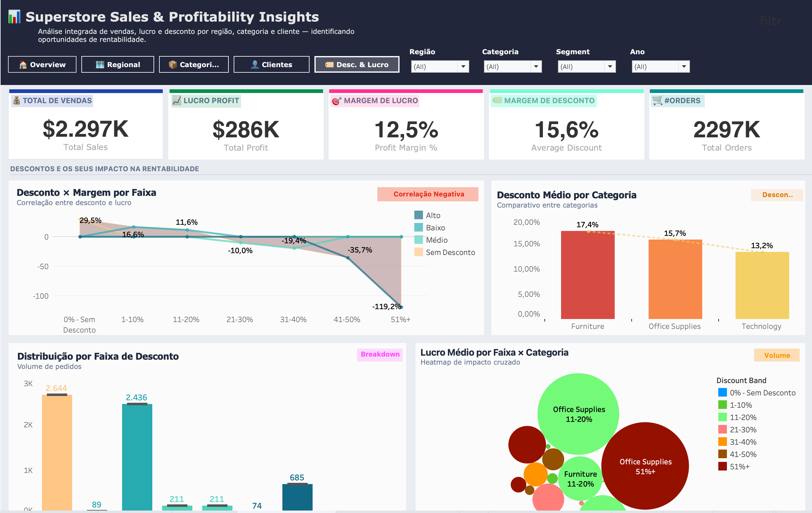

# Superstore Sales & Profitability Insights (Tableau)

Dashboard analítico desenvolvido em Tableau a partir do dataset público **Sample – Superstore**, com foco em **rentabilidade e impacto de descontos** ao longo de regiões, categorias e clientes.

O objetivo do projeto é demonstrar, em nível profissional, competências de **Análise de Dados / BI**: modelagem de métricas, cálculos avançados, design de dashboards e storytelling orientado à tomada de decisão.

---

## 🎯 Objetivo do Projeto

- Integrar **vendas, lucro, margem e descontos** em uma visão única.
- Identificar **onde a empresa vende muito e lucra pouco** (ou até perde dinheiro).
- Mapear o impacto de **faixas de desconto** na margem de lucro.
- Avaliar a performance por **região, categoria e cliente**, suportando decisões de pricing, segmentação e portfólio.

---

## 🧱 Estrutura do Dashboard

O projeto foi organizado em 5 abas principais:

## 📷 Preview







### 1. Overview
Visão executiva com foco em resumo de performance:

- **KPIs principais:**
  - Total Sales (Vendas Totais)
  - Total Profit (Lucro Total)
  - Profit Margin (%) – Margem de Lucro
  - Average Discount – Desconto Médio
  - #Orders – Número de Pedidos
- **Vendas & Lucro Mensais**  
  Série temporal de vendas e lucro ao longo do ano.
- **Vendas por Segmento**  
  Distribuição de receita entre Consumer, Corporate e Home Office.
- **Mix de Categorias**  
  Treemap com participação em vendas de Technology, Office Supplies e Furniture.
- **Lucro por Sub-Categoria**  
  Ranking dos maiores contribuidores (positivos e negativos) de lucro.

---

### 2. Regional
Análise comparativa entre regiões:

- **Vendas & Lucro por Região**  
  Barras comparando volume de vendas e lucro (South, Central, East, West).
- **Radar de Margem % por Região**  
  Gráfico de radar destacando a rentabilidade relativa entre regiões.
- **Scorecard Regional**  
  Tabela consolidada com:
  - Sales
  - Profit
  - Profit Margin %
- **Vendas por Estado – Top 10**  
  Ranking dos estados com maior volume de vendas.

---

### 3. Categorias
Foco no mix de produtos e rentabilidade por categoria:

- **Painéis por Categoria (Technology, Office Supplies, Furniture)**  
  Cada categoria com:
  - Vendas por subcategoria
  - Margem média da categoria
- **Ranking de Sub-Categorias**  
  Tabela com:
  - Vendas
  - Lucro
  - Margem (%)
- **Margem % por Sub-Categoria**  
  Barras horizontais com linha de meta (ex.: 12% de margem alvo), destacando:
  - Subcategorias acima da meta
  - Subcategorias críticas (abaixo da meta ou negativas)

---

### 4. Clientes
Análise de rentabilidade de clientes:

- **Top 10 Clientes por Lucro**  
  Ranking de clientes “Champions” que mais contribuem para o resultado.
- **Clientes com Prejuízo**  
  Lista dos clientes com menor rentabilidade (profit negativo), com destaque em escala de cor.
- **Lucro por Segmento**  
  Donut chart com profit share entre Consumer, Corporate e Home Office.
- **Pedidos por Segmento & Região**  
  Distribuição do volume de pedidos cruzando segmentação e geografia.

---

### 5. Descontos & Lucro
Módulo dedicado ao impacto dos descontos na rentabilidade:

- **Desconto x Margem por Faixa**  
  Linha/área evidenciando a correlação entre faixas de desconto (0%, 1–10%, 11–20%, 21–30%, 31–40%, 41–50%, 51%+) e a margem média de lucro.
- **Distribuição por Faixa de Desconto**  
  Volume de pedidos em cada faixa de desconto, mostrando concentração de esforço comercial.
- **Desconto Médio por Categoria**  
  Comparativo de desconto médio em Furniture, Office Supplies e Technology.
- **Lucro Médio por Faixa × Categoria**  
  Bubble chart/heatmap cruzando faixas de desconto e categorias para identificar onde o desconto destrói mais margem.

---

## 🔢 Principais Cálculos (Tableau)

Alguns campos calculados utilizados no projeto:

```tableau
// Margem de Lucro
[Profit Margin] = SUM([Profit]) / SUM([Sales])

// Ticket Médio por Pedido
[Average Order Value] = SUM([Sales]) / COUNTD([Order ID])

// Desconto Médio
[Average Discount] = AVG([Discount])

// Classificação de Risco de Desconto
[Discount Risk] =
IF [Discount] >= 0.40 THEN "Crítico"
ELSEIF [Discount] >= 0.25 THEN "Alto"
ELSEIF [Discount] >= 0.15 THEN "Moderado"
ELSE "Saudável"
END

// Crescimento Mês contra Mês (MoM) de Vendas
[MoM Sales Growth] =
(
    SUM([Sales]) - LOOKUP(SUM([Sales]), -1)
)
/
ABS(LOOKUP(SUM([Sales]), -1))

// Margem de Lucro por Cliente (LOD)
[Customer Profit Margin (Fixed)] =
SUM({ FIXED [Customer ID] : [Profit] }) 
/
SUM({ FIXED [Customer ID] : [Sales] })
```

Esses cálculos demonstram uso de **Table Calculations** (LOOKUP) e **LOD Expressions (FIXED)**, comuns em cenários reais de BI.

---

## 📌 Principais Insights de Negócio (incluindo viés comportamental/psicométrico)

1. **Descontos elevados levam a comportamento destrutivo de margem**  
   A análise de “Desconto x Margem por Faixa” mostra que, a partir de ~**31–40% de desconto**, a margem média cai fortemente, tornando-se fortemente negativa nas faixas **41–50% e 51%+**.  
   Isso evidencia um padrão típico de comportamento comercial: uso de desconto como ferramenta principal de negociação, mesmo quando já não faz sentido econômico.

2. **Furniture tem comportamento de risco: alta receita, baixa disciplina de margem**  
   Enquanto Technology e Office Supplies operam com margens médias em torno de **17%**, a categoria Furniture trabalha com margem média próxima de **2–3%**, mesmo representando mais de 30% do mix em determinadas visões.  
   Esse descolamento sugere decisões comerciais pouco disciplinadas em Furniture (descontos agressivos, pouca atenção a custo/margem), apesar do volume relevante.

3. **Subcategorias críticas concentram “viés de volume”**  
   Subcategorias como **Tables e Bookcases** combinam **alto volume de vendas com lucro negativo**, indicando um viés de foco em faturamento/market share, sem contrapartida em rentabilidade.  
   Na prática, a empresa parece premiar ou aceitar negócios “grandes” mesmo quando são estruturalmente ruins em margem.

4. **Perfil de clientes: poucos “Champions” sustentam o resultado**  
   O Top 10 de clientes concentra uma fatia desproporcional do lucro total, com tickets médios altos e descontos controlados.  
   Psicologicamente, isso sugere um relacionamento de **parceria de valor** com esses clientes (menos sensíveis apenas a preço, mais a serviço/solução), em contraste com clientes de prejuízo que pressionam por preço e descontos extremos.

5. **Segmentos com mindset distinto de compra**  
   Consumer representa cerca de metade das vendas, mas a combinação de **segmento + faixa de desconto + categoria** revela perfis diferentes de comportamento de compra:
   - Corporate tende a operar com tickets maiores e, em alguns casos, descontos mais altos por negociação B2B.
   - Home Office aparece mais pulverizado, com menor volume, porém com margens razoáveis.  
   Isso reforça a necessidade de políticas de desconto e ofertas **segmentadas**, e não uma regra única para todos.

6. **Concentração de esforço comercial em faixas de desconto subótimas**  
   A distribuição de pedidos por faixa mostra grande volume em níveis onde a margem já começou a se deteriorar, mas ainda não é abertamente “proibida” (faixas intermediárias).  
   Isso ilustra um viés comportamental clássico: vendedores evitam extremos, mas se acomodam em um “desconto padrão” que parece aceitável para todos, sem avaliar o impacto exato na rentabilidade.

---

## 🧠 Perspectiva Psicométrica / Comportamental

Além dos números, o dashboard ajuda a entender o **comportamento dos agentes de decisão**:

- **Força do viés de desconto:** evidenciado pela correlação clara entre “faixa de desconto” e “margem”, mostrando excesso de confiança em desconto como solução genérica.
- **Dependência de poucos clientes campeões:** sugestivo de uma carteira com risco de concentração, onde a perda de poucos clientes pode comprometer resultados.
- **Mindset orientado a volume em algumas categorias:** Furniture e algumas subcategorias apresentam padrão de “vender a qualquer custo”, típico de contextos de metas agressivas de faturamento.

Esses pontos podem ser usados em discussões sobre **comportamento comercial, incentivos e desenho de políticas de preço e desconto**.

---

## 🛠️ Ferramentas Utilizadas

- **Tableau Desktop** para construção do dashboard e cálculos.
- Dataset público **Sample – Superstore**.
- Organização do projeto via **Git e GitHub**.

---

## 📂 Como Reproduzir

1. Baixe o arquivo do dashboard (`Superstore_Sales_Profitability.twbx`) na pasta `/dashboard`.
2. Abra no **Tableau Desktop**.
3. Certifique-se de que a fonte de dados esteja apontando para o arquivo `Sample_Superstore_Orders` na pasta `/data`, se necessário.
4. Navegue pelas abas: **Overview, Regional, Categorias, Clientes, Desc. & Lucro**.

---

## 🔗 Dashboard Interativo

Acesse o dashboard completo e interativo no Tableau Public:  
👉 [Superstore Sales & Profitability Dashboard](https://public.tableau.com/app/profile/ivan.ajala/viz/superstore_dashboard_17804269822950/DB-Overview?publish=yes)

---

## 💬 Sobre o Autor

Projeto desenvolvido por **Ivan** como parte de portfólio em **Análise de Dados / BI**, com foco em:

- Modelagem de métricas de negócio;
- Uso de cálculos avançados no Tableau;
- Design de dashboards analíticos;
- Interpretação de resultados com viés de comportamento/comercial.
