# UCI SECOM — Quality Analytics & Predictive Diagnostics

Projeto de análise estatística e modelagem preditiva aplicado ao dataset industrial **SECOM (UCI Machine Learning Repository)**, com foco na detecção de falhas de qualidade em processo de manufatura de semicondutores.

O projeto combina três camadas de trabalho: **análise exploratória e estatística**, **modelagem preditiva (ciência de dados)** e **um dashboard interativo (Business Intelligence)** para comunicação de resultados e apoio à decisão.

---

## 📌 Sobre o Projeto

O objetivo central é identificar quais sensores de processo estão mais associados à ocorrência da classe **FAIL**, e usar essa informação para:

- Priorizar sensores para investigação e monitoramento;
- Avaliar a viabilidade de um modelo preditivo de falhas;
- Traduzir os resultados técnicos em um dashboard executivo, navegável por qualquer stakeholder não técnico.

Este projeto foi desenvolvido para demonstrar, de forma prática, competências de **Quality Management & Data Analyst**: análise estatística de processo, causa raiz orientada por dados, dashboarding de KPIs, estruturação de dados de não conformidade e comunicação analítica executiva.

---

## 🎯 O Problema de Negócio

Em processos industriais estáveis, a grande maioria das unidades produzidas é aprovada, e apenas uma pequena fração falha. O SECOM reflete exatamente esse cenário:

- **~93% PASS**
- **~7% FAIL**

Esse desbalanceamento é crítico para a análise: um modelo que sempre prevê "PASS" atingiria ~93% de acurácia sem detectar nenhuma falha real. Por isso, o projeto prioriza métricas adequadas a cenários desbalanceados:

- **Recall de FAIL** (capacidade de detectar falhas reais);
- **Precision de FAIL**;
- **F1-score**;
- **ROC-AUC**;
- **Curva Precision-Recall**.

O foco de negócio é claro: **detectar o máximo de falhas reais possível**, mesmo aceitando um aumento controlado de falsos positivos — já que, no contexto industrial, o custo de uma falha não detectada tende a ser maior do que o custo de uma inspeção adicional.

---

## 💼 Conexão com a Experiência Profissional

| Competência de Quality Management & Data Analyst | Como foi aplicada neste projeto |
|---|---|
| Análise estatística de processos | Correlação sensor–falha, ANOVA F-score, distribuição PASS/FAIL |
| Controle de indicadores de qualidade | Dashboard com KPIs, rankings e monitoramento de sensores críticos |
| Root Cause Analysis orientada por dados | Priorização de sensores via consenso entre múltiplas métricas estatísticas |
| Estruturação de dados de não conformidade | Modelagem da classe FAIL como evento a ser explicado e previsto |
| Otimização de processos | Identificação de sensores de maior sinal para ação preventiva |
| Relatórios executivos | Dashboard navegável com linguagem acessível e Dicionário de Dados |
| Excel/Power BI e dashboarding | Estrutura de BI equivalente construída em React, com lógica de camadas |
| SQL básico | Estruturação e consulta dos dados processados |
| Ciência de dados | Seleção de features, Random Forest, validação cruzada, análise de threshold |

---

## 🗃️ Dataset

A base utilizada é uma versão tratada do dataset SECOM, contendo:

**Variáveis de controle:**
- `Unit_ID`
- `Label`
- `Timestamp`
- `Result`

**Variáveis de processo:**
- Centenas de sensores (`Sensor_*`)

No pipeline de tratamento:
- Sensores com excesso de valores ausentes foram removidos;
- Os valores remanescentes foram imputados;
- A base limpa foi salva em `data/processed/secom_clean.csv`.

---

## 🔄 Pipeline Analítico

O projeto segue quatro etapas sequenciais:

1. **Extração/Exploração** (`src/01_extract.py`) — inspeção da base bruta, estrutura, tipos de variáveis e distribuição inicial das classes.
2. **Transformação** (`src/02_transform.py`) — tratamento de missing values, limpeza e geração da base processada.
3. **Análise Exploratória** (`src/03_analysis.py`) — distribuição PASS/FAIL, estatísticas descritivas, correlação sensor–alvo, identificação de sensores críticos.
4. **Modelagem** (`src/04_model.py`) — seleção de variáveis, treinamento do modelo preditivo e avaliação por métricas robustas ao desbalanceamento.

Os notebooks equivalentes (`.ipynb`) estão disponíveis na mesma pasta, documentando o processo de forma exploratória e reprodutível.

---

## 🔍 Sensores Críticos Identificados

A análise exploratória revelou dois grupos de sensores com comportamento distinto em relação à ocorrência de FAIL.

### Correlação positiva com FAIL
*(valores altos indicam maior risco de falha)*

`Sensor_060` · `Sensor_104` · `Sensor_511` · `Sensor_349` · `Sensor_432` · `Sensor_435` · `Sensor_431` · `Sensor_022` · `Sensor_436` · `Sensor_437`

### Correlação negativa com FAIL
*(valores baixos indicam maior risco de falha)*

`Sensor_029` · `Sensor_317` · `Sensor_126` · `Sensor_027` · `Sensor_181` · `Sensor_123` · `Sensor_453` · `Sensor_128` · `Sensor_023` · `Sensor_015`

Essa distinção é operacionalmente relevante: em alguns sensores o alerta deve ser disparado por **elevação** da leitura; em outros, por **queda**.

---

## 🤖 Metodologia de Modelagem

**Seleção de variáveis:**
- ANOVA F-score (`SelectKBest` + `f_classif`);
- Seleção dos **top 40 sensores**.

**Modelo:**
- `RandomForestClassifier`
- `class_weight={0: 1, 1: 5}`
- `n_estimators=200`
- `StratifiedKFold` com 10 folds
- Split estratificado 80/20 para avaliação detalhada

**Por que Random Forest:**
- Lida bem com alto número de variáveis;
- Captura relações não lineares;
- Tolera colinearidade entre sensores;
- Gera feature importance interpretável;
- Funciona como baseline robusto.

---

## 📊 Resultados

- **ROC-AUC médio (validação cruzada): ~0,75**
- Recall de FAIL baixo no threshold padrão (0,50) — indicando corte conservador demais para a classe minoritária
- A análise de threshold mostrou que reduzir o ponto de corte aumenta significativamente o recall de FAIL, ao custo de mais falsos positivos — um trade-off aceitável neste contexto industrial

> O problema não é ausência de sinal nos dados, e sim o ponto de corte utilizado para classificar a falha.

A combinação entre **correlação**, **F-score (ANOVA)** e **feature importance do Random Forest** reforça a consistência dos sensores identificados como críticos, aumentando a confiabilidade da priorização.

---

## 🖥️ Dashboard Interativo — Camada de BI

O dashboard foi desenvolvido em **React + Vite**, consumindo diretamente os outputs gerados pelo pipeline analítico (`eda_outputs/` e `model_outputs/`). Ele funciona como a camada de comunicação e tomada de decisão do projeto, traduzindo os resultados estatísticos e do modelo em uma navegação acessível para stakeholders não técnicos.

### ▶️ Como Executar o Dashboard

```dash
cd dashboard/web-app
npm install
npm run dev
```

Acesse: `http://localhost:5173/`

Para gerar a versão de produção:

```bash
npm run build
npm run preview
```

---

### 1️⃣ Página 1 — Visão Geral

Apresenta uma leitura executiva dos sensores mais relevantes: KPIs gerais, ranking de importância (Random Forest), ranking de F-Score e as tabelas de correlação positiva/negativa com FAIL.

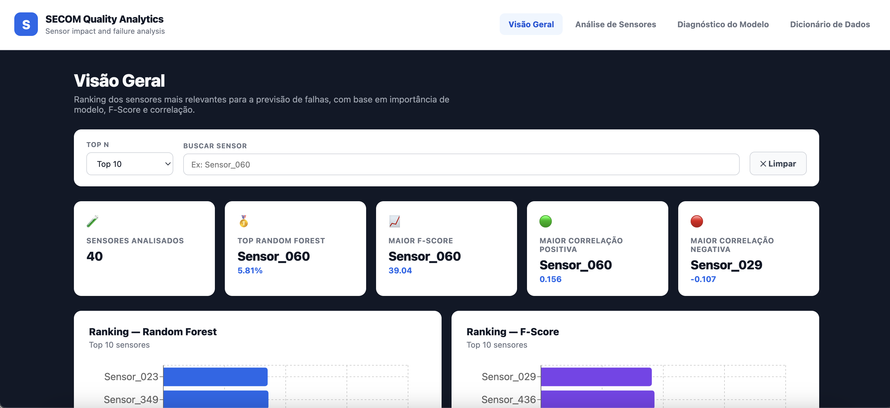
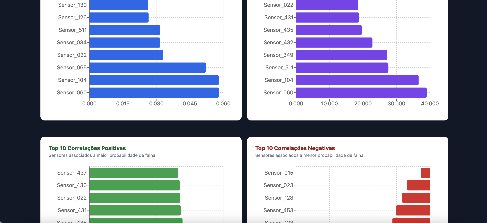
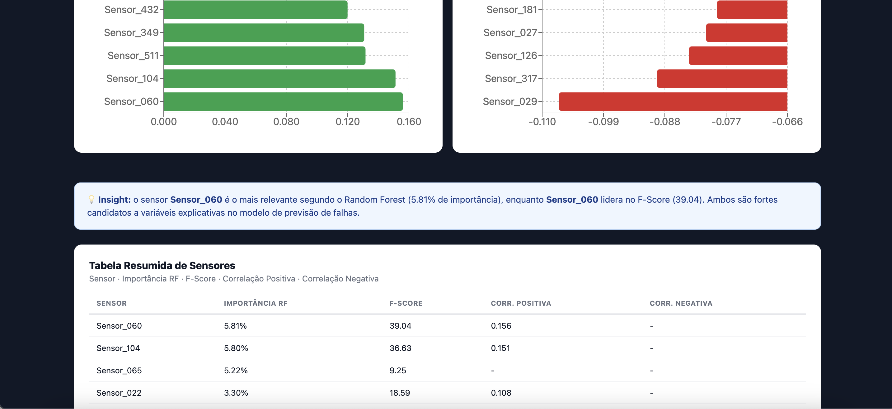
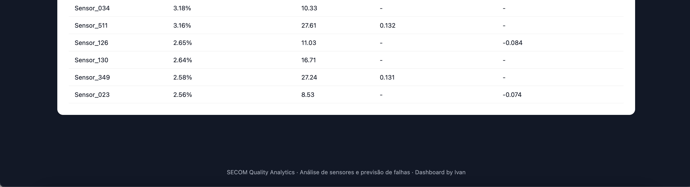

---

### 2️⃣ Página 2 — Análise de Sensores

Permite explorar individualmente cada sensor identificado pelo pipeline, com busca, filtro por Top N, filtro por tipo de correlação e visualização comparativa.

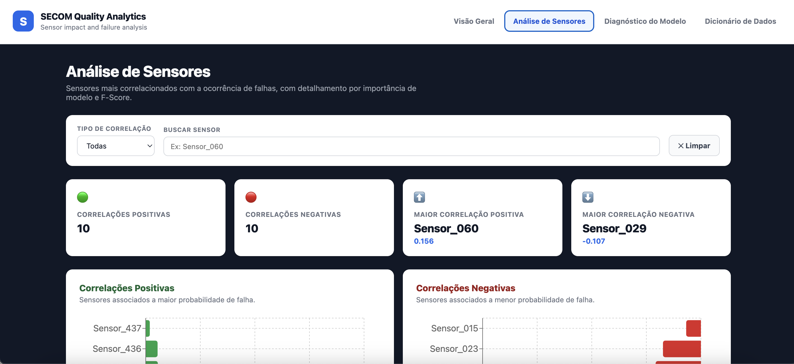
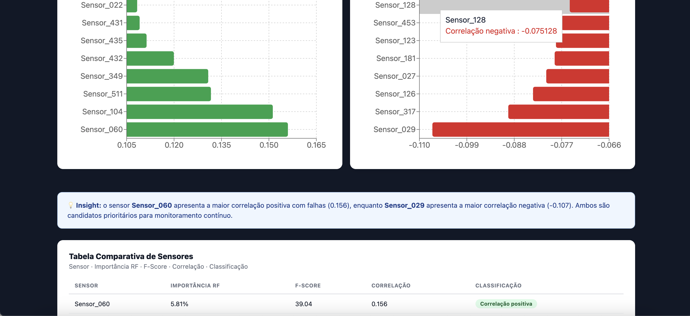
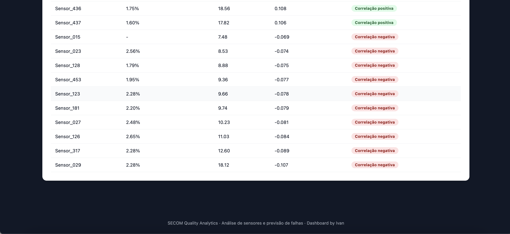

---

### 3️⃣ Página 3 — Diagnóstico do Modelo

Combina três evidências estatísticas independentes — importância do Random Forest, F-Score (ANOVA) e correlação com FAIL — em um score de consenso, usado para classificar o nível de prioridade de cada sensor:

$$
\text{Score de Consenso} =
\frac{
\text{RF normalizado} +
\text{F-Score normalizado} +
|\text{Correlação normalizada}|
}{3}
$$

> Este score é uma ferramenta de priorização para investigação, não uma métrica oficial do modelo. Correlação não implica causalidade, e a validação operacional depende de especialistas do processo.

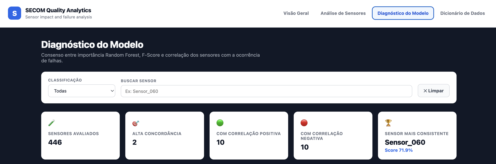
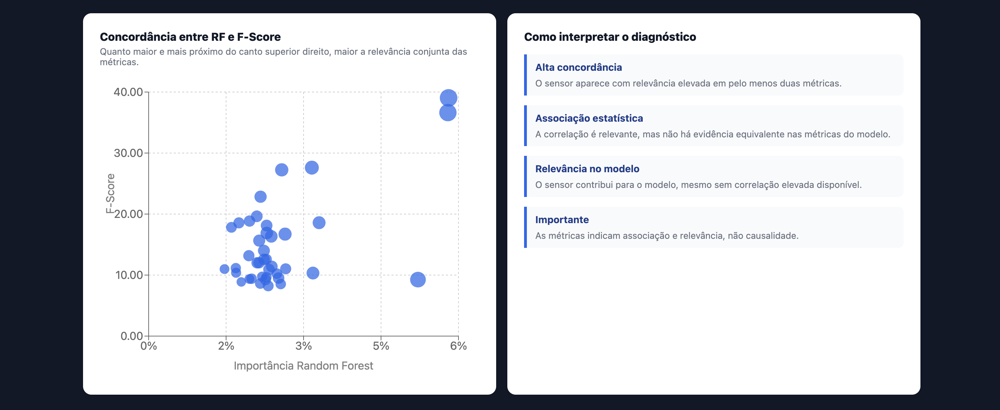
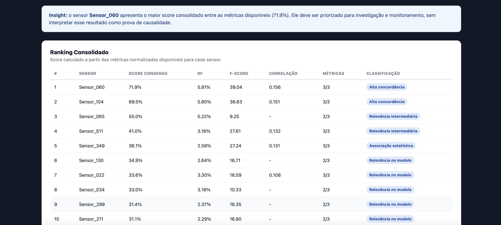
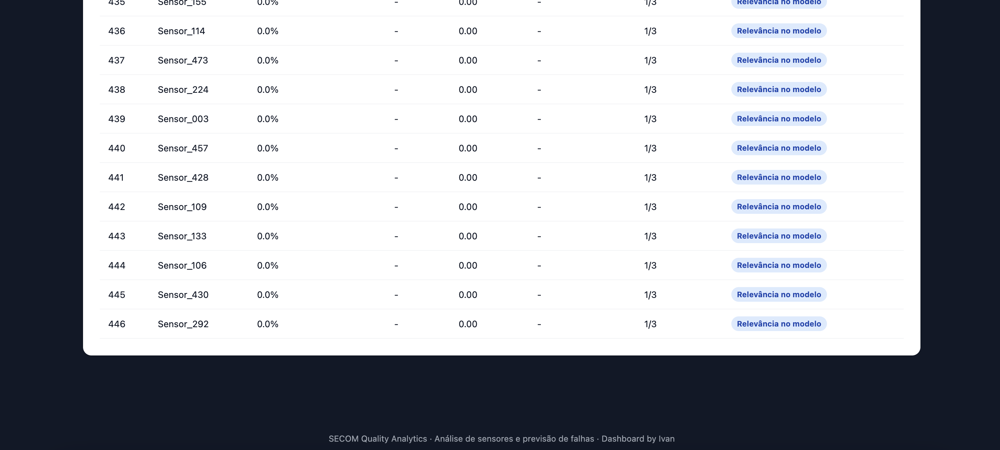

---

### 4️⃣ Página 4 — Dicionário de Dados

Documenta o significado de cada métrica, arquivo e classificação utilizada no dashboard, reforçando a transparência metodológica e facilitando a leitura por usuários não técnicos.

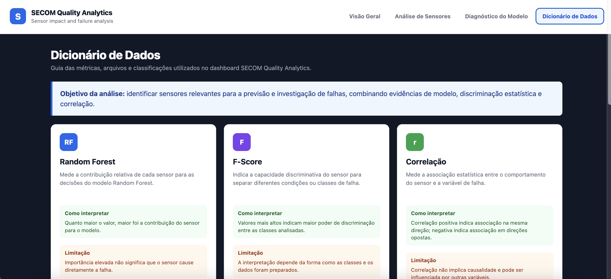
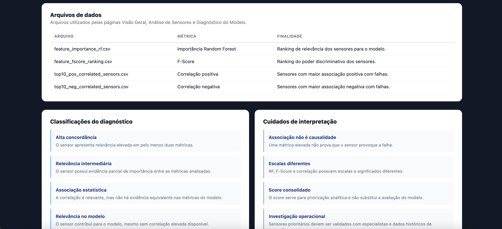
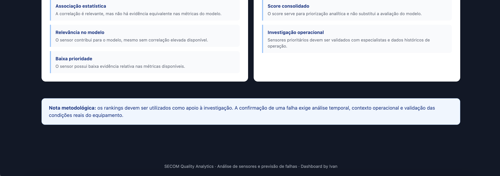

---

## 📁 Estrutura do Repositório

```batch
projeto-02-quality-analytics-secom/
├── README.md
├── data/
│   ├── raw/
│   └── processed/
│       ├── secom_clean.csv
│       ├── eda_outputs/
│       └── model_outputs/
├── src/
│   ├── 01_extract.py
│   ├── 02_transform.py
│   ├── 03_analysis.py
│   └── 04_model.py
├── dashboard/
│   ├── Book1.twb
│   └── web-app/
├── screenshots/
├── docs/
```

---

## 🛠️ Tecnologias Utilizadas

- **Python** (pandas, numpy, scikit-learn, matplotlib, seaborn)
- **Jupyter Notebook**
- **React + Vite** (dashboard)
- **Tableau** (versão alternativa do dashboard: `Book1.twb`)
- **Git/GitHub**

---

## ⚠️ Limitações e Próximos Passos

- O threshold padrão (0,50) não é adequado para este problema; um ajuste formal do ponto de corte é recomendado antes de qualquer uso operacional;
- O consenso entre correlação, F-score e feature importance indica associação estatística, não causalidade — validação de causa raiz depende de investigação de processo por especialistas;
- Próximas extensões possíveis: tuning de hiperparâmetros, teste de outros algoritmos, técnicas de balanceamento (SMOTE/undersampling), busca formal do threshold ótimo, e incorporação de gráficos de controle estatístico (SPC) caso dados temporais estejam disponíveis.

---

## 👤 Autor

**Ivan** — Quality Management & Data Analyst