# Project Portfolio Management — Analytics & Predictive Risk Dashboard

Projeto de análise de portfólio de projetos com foco em **gestão de prazo, custo, qualidade e risco**, combinando modelagem preditiva de risco (ciência de dados) e um dashboard executivo interativo (Business Intelligence).

O projeto simula um portfólio corporativo realista, com **530 projetos** distribuídos entre 2020 e 2026, permitindo análise de tendências de longo prazo, desempenho por área de negócio e priorização de projetos com maior risco de atraso ou estouro orçamentário.

---

## 📌 Sobre o Projeto

O objetivo central é consolidar os principais indicadores de gestão de portfólio em um único painel, permitindo:

- Monitorar o cumprimento de prazos e orçamentos em nível de portfólio e por projeto individual;
- Identificar projetos com maior risco de atraso ou estouro de custo, usando modelos preditivos;
- Avaliar o desempenho histórico por área de negócio, tipo de projeto e complexidade;
- Traduzir os resultados técnicos em um dashboard executivo, navegável por qualquer stakeholder não técnico.

Este projeto foi desenvolvido para demonstrar, de forma prática, competências de **Project Management & Data Analyst**: acompanhamento de indicadores de prazo e custo, priorização de riscos orientada por dados, dashboarding executivo de portfólio e comunicação analítica para gestão.

---

## 🎯 O Problema de Negócio

Em portfólios com centenas de projetos simultâneos, é comum que gestores percam visibilidade sobre quais iniciativas realmente estão em risco de atraso ou estouro orçamentário, até que o problema já esteja consolidado.

Este projeto aborda esse cenário ao consolidar, para cada um dos **530 projetos**:

- **Variância de prazo** (planejado vs. real);
- **Variância de custo** (orçamento vs. custo real);
- **Score de qualidade** e **satisfação do cliente**;
- **Probabilidade preditiva de risco de atraso e de estouro de custo**, gerada por modelos de Machine Learning.

O foco de negócio é claro: **antecipar riscos de portfólio antes que se tornem problemas consolidados**, permitindo ação preventiva por parte de gestores e sponsors.

---

## 💼 Conexão com a Experiência Profissional

| Competência de Project Management & Data Analyst | Como foi aplicada neste projeto |
|---|---|
| Gestão de cronograma | Cálculo de variância de prazo (planejado vs. real) e taxa de entregas no prazo |
| Gestão de custos e orçamento | Cálculo de variância de custo, absoluta e percentual, por projeto e por portfólio |
| Gestão de riscos | Flags de risco, níveis de risco e clusterização de perfis de risco |
| Priorização de portfólio | Ranking de projetos por risco preditivo de atraso e de estouro de custo |
| Indicadores de qualidade e satisfação | Consolidação de score de qualidade e satisfação do cliente por projeto e por área |
| Relatórios executivos | Dashboard navegável com linguagem acessível e Dicionário de Dados |
| Excel/Power BI e dashboarding | Estrutura de BI equivalente construída em React, com lógica de camadas |
| SQL básico | Estruturação e consulta dos dados processados |
| Ciência de dados | Engenharia de features, modelos preditivos de risco, clusterização e validação |

---

## 🗃️ Dataset

O portfólio simulado contém **530 projetos**, iniciados entre 2020 e 2026, distribuídos em três arquivos processados:

**`project_analytics.csv`** — base principal, no nível de projeto:
- Identificação: `project_id`, `project_name`, `client_id`, `project_manager`, `business_unit`, `project_type`, `priority`, `complexity`;
- Datas planejadas e reais de início e término;
- Orçamento planejado, custo real e horas planejadas/reais;
- Tamanho de equipe e status do projeto;
- Scores de qualidade e satisfação do cliente;
- Variâncias de prazo, custo e horas.

**`project_risk_scores.csv`** — indicadores de risco por projeto:
- Flags booleanas de risco de prazo e de custo;
- Probabilidades preditivas de risco, geradas por modelo de Machine Learning;
- Classificação de nível de risco (Baixo, Médio, Alto);
- Cluster de risco e perfil de cluster.

**`monthly_portfolio_snapshot.csv`** — agregados mensais do portfólio:
- Contagem de projetos iniciados, concluídos e cancelados por mês;
- Orçamento e custo agregados de projetos ativos e concluídos;
- Tamanho médio de equipe dos projetos ativos no período.

---

## 🔄 Pipeline Analítico

O projeto segue etapas sequenciais, documentadas em notebooks (`.ipynb`):

1. **Geração e simulação do portfólio** — criação de 530 projetos com datas, orçamentos, equipes e status realistas, distribuídos entre 2020 e 2026.
2. **Engenharia de indicadores** — cálculo de variâncias de prazo, custo e horas, além de flags de cumprimento de prazo e orçamento.
3. **Modelagem preditiva de risco** (`04_portfolio_ml_models`) — treinamento de modelos para estimar a probabilidade de atraso e de estouro de custo, além de clusterização de perfis de risco.
4. **Agregação mensal** — consolidação dos indicadores de projeto em uma visão mensal do portfólio, permitindo análise de tendências ao longo do tempo.

---

## 📐 Indicadores e Regras de Negócio

Os principais indicadores seguem a convenção **planejado menos real**, onde valores positivos indicam resultado favorável (economia ou antecipação) e valores negativos indicam resultado desfavorável (estouro ou atraso):

- **schedule_variance_days** — variância entre duração real e planejada do projeto;
- **cost_variance** e **cost_variance_pct** — variância de custo, absoluta e percentual;
- **completed_on_time** e **completed_within_budget** — flags de cumprimento de prazo e orçamento;
- **quality_band** — faixa qualitativa derivada do score de qualidade final;
- **schedule_risk_level** e **cost_risk_level** — classificação de risco derivada das probabilidades preditivas do modelo.

A documentação completa de todos os campos, com definições e regras de cálculo, está disponível na página **Dicionário** do dashboard.

---

## 🤖 Metodologia de Modelagem Preditiva

**Objetivo:**
- Estimar a probabilidade de cada projeto enfrentar risco de atraso ou de estouro orçamentário, a partir de suas características (complexidade, prioridade, área de negócio, tamanho de equipe, orçamento, entre outras).

**Abordagem:**
- Modelos de classificação supervisionada para as probabilidades de risco de prazo e de custo;
- Clusterização não supervisionada para identificar perfis recorrentes de risco no portfólio (`risk_cluster` / `cluster_profile`).

**Por que essa abordagem:**
- Permite priorizar a atenção da gestão nos projetos com maior probabilidade de risco, antes que o problema se concretize;
- A clusterização revela padrões estruturais no portfólio (por exemplo, projetos de alta complexidade e equipe pequena), úteis para decisões de alocação de recursos;
- As probabilidades e classificações de risco devem ser interpretadas como estimativas, não como certezas.

---

## 📊 Resultados

- Consolidação de **530 projetos** em uma visão única de portfólio, cobrindo o período de 2020 a 2026;
- Identificação de projetos com maior probabilidade de atraso e de estouro de custo, via modelo preditivo;
- Visão de tendências mensais de portfólio, permitindo observar sazonalidade em início, conclusão e cancelamento de projetos;
- Comparação de desempenho entre áreas de negócio, tipos de projeto e níveis de complexidade.

> As probabilidades de risco geradas pelo modelo são estimativas baseadas em padrões históricos do portfólio simulado, e devem ser validadas com o julgamento de gestores de projeto antes de qualquer decisão operacional.

---

## 🖥️ Dashboard Interativo — Camada de BI

O dashboard foi desenvolvido em **React + Vite**, consumindo diretamente os três arquivos CSV processados (`project_analytics.csv`, `project_risk_scores.csv` e `monthly_portfolio_snapshot.csv`). Ele funciona como a camada de comunicação e tomada de decisão do projeto, traduzindo os indicadores de portfólio e os resultados do modelo preditivo em uma navegação acessível para stakeholders não técnicos.

### ▶️ Como Executar o Dashboard

```dash
cd dashboard/web-app
npm install
npm run dev
```

Acesse: `http://localhost:5173/`

Para gerar a versão de produção:

```bash
npm run build
npm run preview
```

---

### 1️⃣ Página 1 — Visão Geral

Apresenta uma leitura executiva do portfólio: KPIs gerais de prazo, custo e qualidade, distribuição de status dos projetos e principais indicadores consolidados.

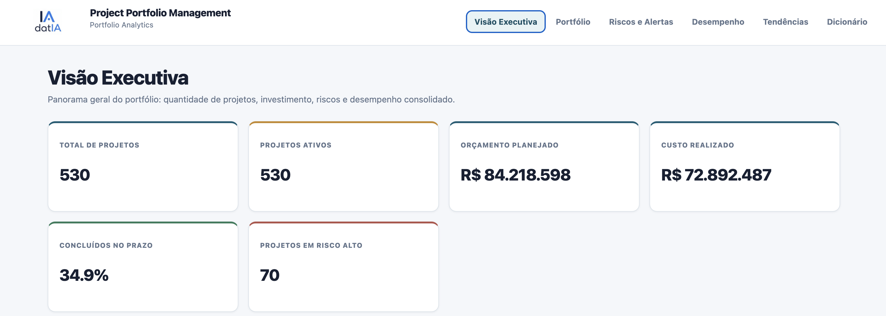
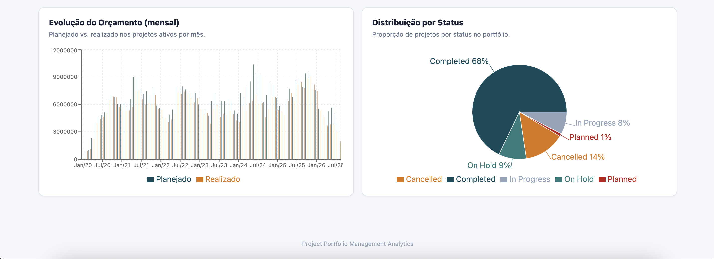

---

### 2️⃣ Página 2 — Portfólio

Permite explorar o portfólio completo de projetos, com filtros por área de negócio, tipo, prioridade, complexidade e status, além de tabela detalhada por projeto.

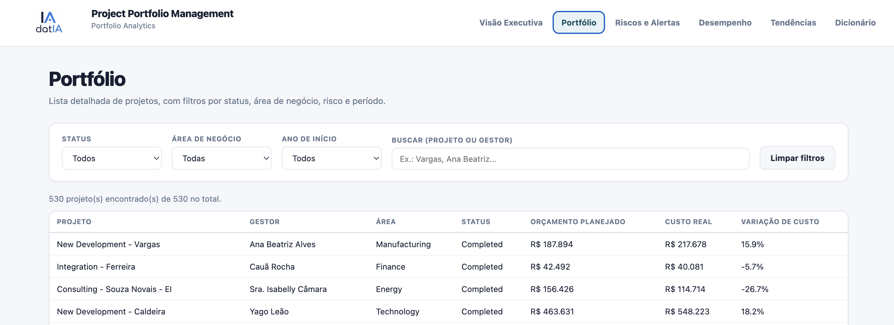
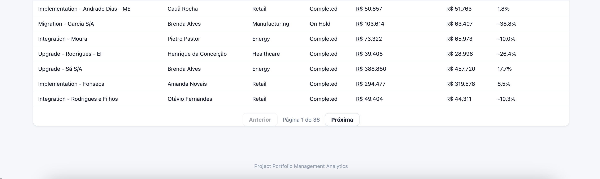

---

### 3️⃣ Página 3 — Riscos e Alertas

Destaca os projetos com maior probabilidade de risco de atraso ou de estouro de custo, segundo o modelo preditivo, com classificação por nível de risco e clusterização de perfis.

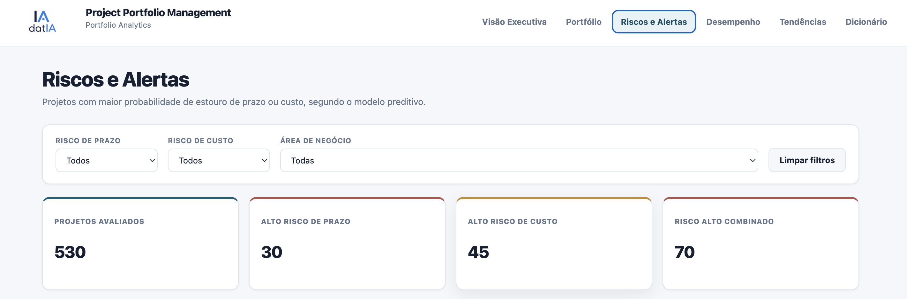
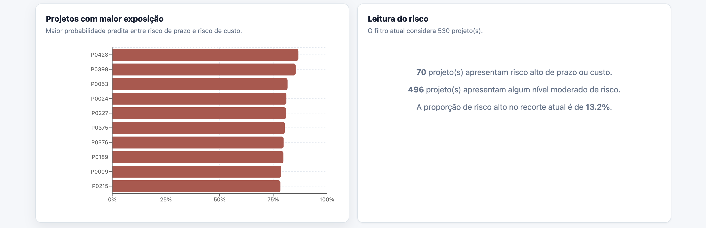
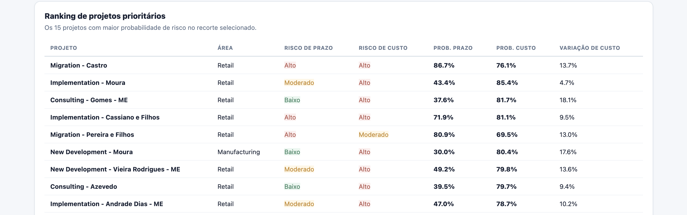
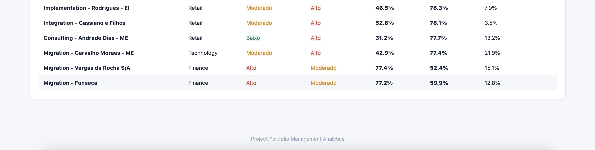

---

### 4️⃣ Página 4 — Desempenho

Compara o desempenho do portfólio por área de negócio, incluindo índice de saúde do portfólio, radar de desempenho e indicadores de projetos concluídos.

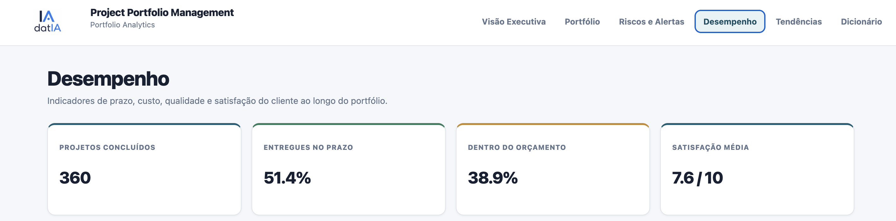
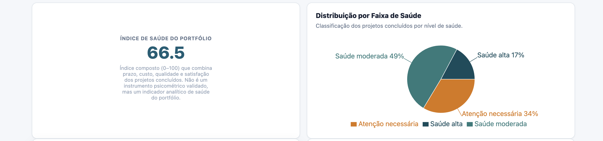
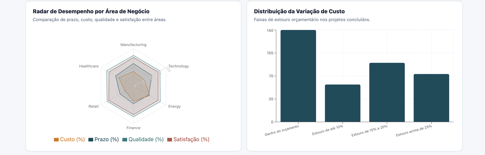
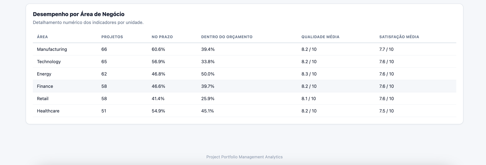

---

### 5️⃣ Página 5 — Tendências

Mostra a evolução mensal do portfólio ao longo do tempo: projetos iniciados, concluídos e cancelados, variação de custo e composição do portfólio.

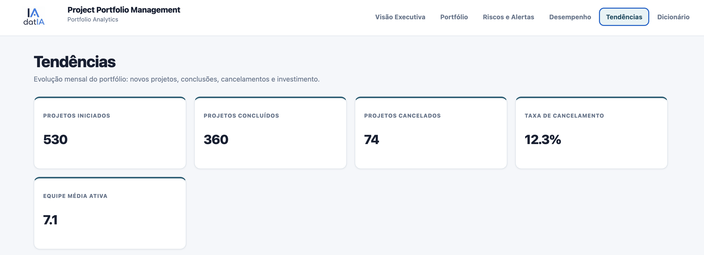
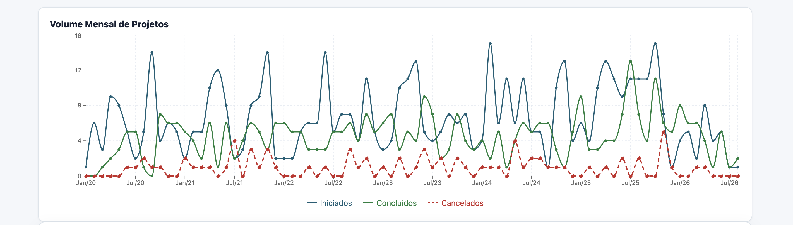
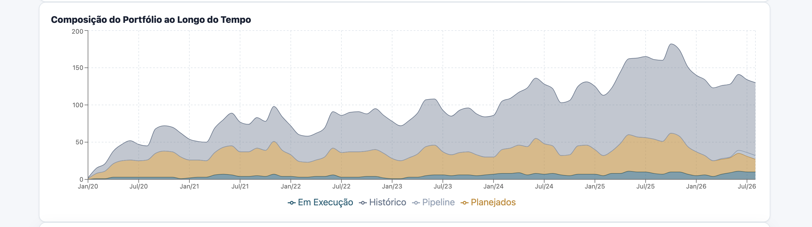
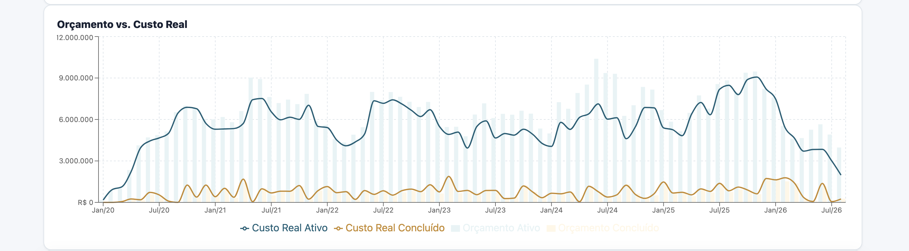
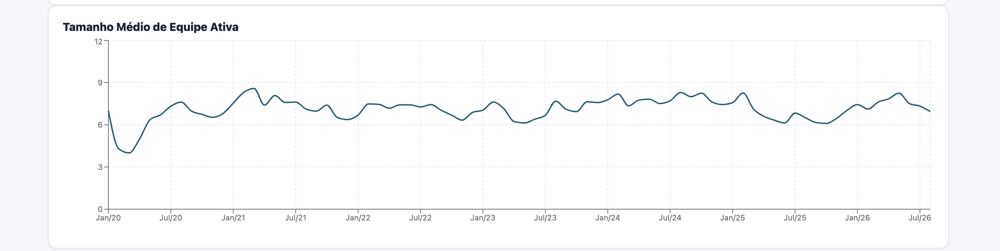
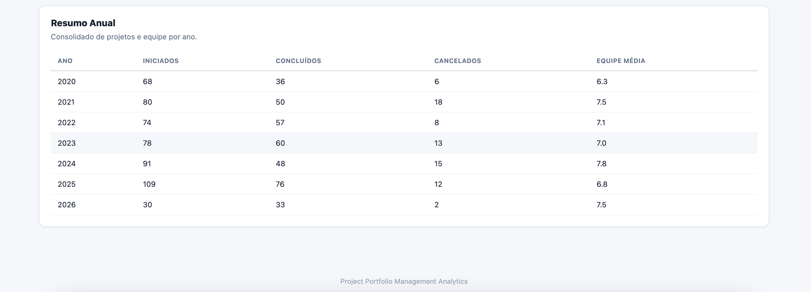

---

### 6️⃣ Página 6 — Dicionário

Documenta o significado de cada campo, indicador e regra de negócio utilizada no dashboard, reforçando a transparência metodológica e facilitando a leitura por usuários não técnicos.

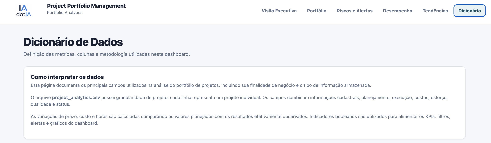
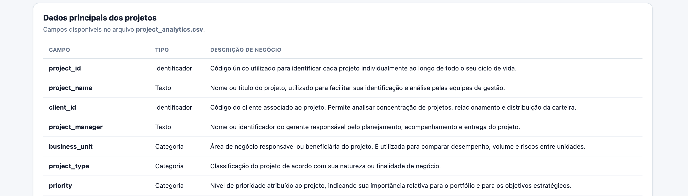
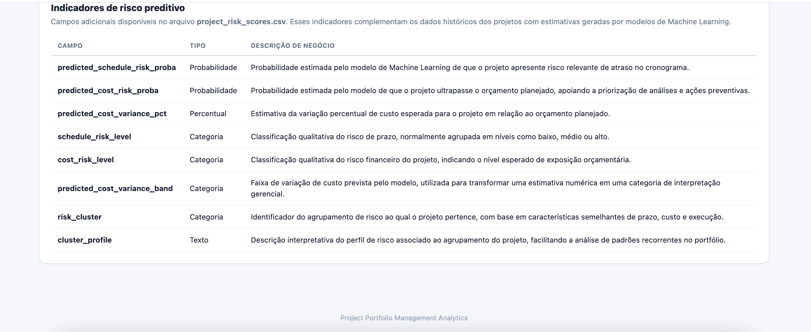

---

## 📁 Estrutura do Repositório

```batch
projeto-03-project-portfolio-management/
├── README.md
├── data/
│   ├── raw/
│   └── processed/
│       ├── project_analytics.csv
│       ├── project_risk_scores.csv
│       └── monthly_portfolio_snapshot.csv
├── notebooks/
│   ├── 01_...
│   ├── 02_...
│   ├── 03_...
│   └── 04_portfolio_ml_models
├── dashboard/
│   └── web-app/
├── screenshots/
├── docs/
```

---

## 🛠️ Tecnologias Utilizadas

- **Python** (pandas, numpy, scikit-learn)
- **Jupyter Notebook**
- **React + Vite** (dashboard)
- **Git/GitHub**

---

## ⚠️ Limitações e Próximos Passos

- O portfólio é simulado, e não reflete dados reais de uma organização específica — os padrões observados servem para fins de demonstração analítica e de storytelling de dados;
- As probabilidades de risco geradas pelo modelo preditivo são estimativas baseadas em padrões do portfólio simulado, e não substituem o julgamento de gestores de projeto;
- Próximas extensões possíveis: incorporação de dados reais de portfólio, tuning de hiperparâmetros dos modelos de risco, testes de outros algoritmos de classificação e clusterização, e adição de alertas automatizados para projetos que cruzem determinados limiares de risco.

---

## 👤 Autor

**Ivan** — Project Management & Data Analyst
