# Revenue Strategy & Operations — Analytics & Predictive Revenue Dashboard

Projeto de análise de receita e projeção de vendas com foco em **Revenue
Strategy & Operations**, combinando análise histórica, indicadores executivos,
modelagem preditiva de receita e dashboard interativo.

A solução foi desenvolvida para transformar dados transacionais em uma visão
executiva de desempenho comercial, permitindo acompanhar a evolução mensal da
receita, analisar indicadores de negócio e interpretar uma projeção direcional
para os meses seguintes.

---

## 📌 Sobre o Projeto

O projeto simula uma solução analítica para apoiar decisões relacionadas a:

- planejamento de receita;
- acompanhamento de desempenho comercial;
- análise de pedidos e ticket médio;
- avaliação da base de clientes;
- comparação entre receita histórica e projetada;
- comunicação de resultados para públicos técnicos e executivos.

O projeto combina um pipeline analítico desenvolvido em Python e Jupyter
Notebook com um dashboard executivo desenvolvido em React e Vite.

A proposta central é conectar:

```text
Dados transacionais
        ↓
Agregação mensal da receita
        ↓
Comparação de modelos
        ↓
Seleção do baseline
        ↓
Forecast de receita
        ↓
Dashboard executivo
```

---

## 🎯 O Problema de Negócio

Em operações comerciais, acompanhar apenas a receita histórica não é
suficiente para apoiar o planejamento futuro.

É necessário responder perguntas como:

- Qual foi a evolução mensal da receita?
- Como o volume de pedidos se comportou?
- Qual foi o ticket médio da operação?
- Qual é o valor estimado para os próximos meses?
- O modelo utilizado é confiável para planejamento?
- Onde termina o histórico observado?
- A partir de qual mês começa a projeção?
- Como comunicar as limitações do forecast para usuários não técnicos?

Este projeto aborda esse cenário ao consolidar indicadores históricos e uma
projeção mensal em uma interface executiva única.

O dashboard não apresenta a projeção como uma certeza absoluta. O resultado é
posicionado como uma referência direcional para planejamento, acompanhada de
contexto metodológico e limitações conhecidas.

---

## 💼 Conexão com a Experiência Profissional

| Competência de Revenue Strategy & Operations | Como é demonstrada no projeto |
|---|---|
| Modelagem preditiva de receita | Comparação de modelos e seleção de uma média móvel como baseline |
| Planejamento comercial | Geração de projeção mensal para um horizonte futuro |
| Análise de receita | Agregação da receita bruta por mês |
| Análise de pedidos | Consolidação do volume de pedidos e indicadores operacionais |
| Ticket médio | Relação entre receita total e quantidade de pedidos |
| Performance comercial | Dashboard executivo com KPIs e evolução histórica |
| Comunicação analítica | Explicação visual do modelo, RMSE e limitações |
| Data storytelling | Transformação de resultados técnicos em narrativa executiva |
| Data pipeline | Geração de arquivos processados utilizados pelo dashboard |
| Governança analítica | Separação explícita entre histórico e projeção |

---

## 🗃️ Dados Utilizados

O projeto utiliza dados transacionais derivados da base Olist, agregados em
diferentes níveis para atender às necessidades da análise.

### `monthly_revenue.csv`

Série histórica mensal da receita, contendo campos como:

- `purchase_month`;
- `orders`;
- `delivered_orders`;
- `product_revenue`;
- `gross_revenue`;
- `average_ticket`;
- `revenue_growth_mom`;
- demais indicadores derivados da receita mensal.

### `revenue_forecast.csv`

Arquivo com os resultados da projeção e os metadados do modelo:

- `forecast_month`;
- `forecast_gross_revenue`;
- `lower_bound`;
- `upper_bound`;
- `model_used`;
- `training_window_start`;
- `training_window_end`;
- `test_window_start`;
- `test_window_end`;
- `approximate_error_rmse`.

### `dashboard_summary.json`

Arquivo consolidado utilizado para alimentar os indicadores executivos da
Visão Executiva, incluindo:

- receita total;
- total de pedidos;
- ticket médio;
- meses observados;
- clientes únicos;
- segmentos;
- total projetado;
- horizonte do forecast;
- modelo selecionado;
- RMSE aproximado.

---

## 🔄 Pipeline Analítico

O projeto segue as seguintes etapas:

1. **Preparação dos dados transacionais**  
   Tratamento dos dados de pedidos e organização das datas de compra.

2. **Agregação mensal**  
   Consolidação da receita, pedidos, ticket médio e crescimento mensal.

3. **Construção da série de modelagem**  
   Seleção da janela histórica mais consistente para comparação dos modelos.

4. **Comparação de modelos**  
   Avaliação de modelos de referência, incluindo média móvel, modelo ingênuo
   e tendência linear.

5. **Avaliação por RMSE**  
   Comparação dos valores estimados com os valores observados na janela de
   teste.

6. **Seleção do modelo baseline**  
   Escolha da média móvel de três meses por sua transparência e facilidade de
   interpretação.

7. **Geração do forecast**  
   Projeção da receita para os seis meses seguintes ao período observado.

8. **Geração dos artefatos**  
   Criação dos arquivos `revenue_forecast.csv` e
   `dashboard_summary.json`.

9. **Integração com o dashboard**  
   Disponibilização dos arquivos processados em `dashboard/public/data/`.

---

## 📐 Regras de Negócio

### Receita mensal

A receita mensal é calculada a partir da receita bruta associada aos pedidos
do período.

### Ticket médio

O ticket médio representa a relação entre a receita e o volume de pedidos no
período analisado.

### Crescimento mensal

O crescimento mensal compara a receita de um mês com a receita do mês anterior.

### Separação entre histórico e projeção

A aplicação utiliza uma regra explícita para evitar sobreposição entre dados
históricos e projetados:

```text
Histórico: até agosto de 2018
Projeção: a partir de setembro de 2018
```

Setembro de 2018 não deve aparecer simultaneamente como histórico e projeção.

Essa regra é importante para evitar que registros parciais ou anômalos
distorçam os indicadores históricos, especialmente:

- menor receita mensal;
- crescimento médio;
- escala do gráfico;
- leitura da tabela detalhada.

---

## 🤖 Metodologia de Modelagem

### Objetivo

Estimar a receita bruta mensal para os seis meses seguintes ao último período
observado.

### Modelos avaliados

O notebook realiza a comparação entre modelos de referência, incluindo:

- média móvel dos três últimos meses;
- modelo ingênuo baseado no último valor observado;
- tendência linear;
- outras alternativas de baseline disponíveis na análise.

### Modelo selecionado

O modelo selecionado foi a **média móvel de três meses**.

A escolha foi baseada em:

- simplicidade;
- transparência;
- facilidade de interpretação;
- baixo custo de manutenção;
- utilidade como baseline de planejamento.

### Limitação do modelo

A média móvel de três meses não incorpora:

- tendência;
- sazonalidade;
- campanhas comerciais;
- mudanças de preço;
- concorrência;
- mix de produtos;
- variáveis de CRM;
- eventos operacionais.

Por essa razão, o valor projetado permanece constante ao longo do horizonte
futuro.

Esse comportamento é esperado para o modelo escolhido e não representa erro de
execução.

---

## 📊 Configuração e Resultados do Forecast

| Elemento | Resultado |
|---|---|
| Modelo selecionado | Média móvel de 3 meses |
| Janela de treinamento | Janeiro de 2017 a agosto de 2018 |
| Janela de teste | Maio de 2018 a agosto de 2018 |
| Horizonte projetado | Setembro de 2018 a fevereiro de 2019 |
| RMSE aproximado | R$ 70.182,49 |
| Receita mensal projetada | R$ 1.028.237,87 |
| Receita total projetada | R$ 6.169.427,22 |

### Interpretação do RMSE

O RMSE aproximado de **R$ 70.182,49** representa a ordem de grandeza do erro
observado na janela de teste.

Ele deve ser interpretado como uma métrica de avaliação do baseline, e não
como:

- percentual de acurácia;
- intervalo de confiança;
- garantia de receita futura;
- limite formal de variação;
- certeza estatística sobre o resultado.

---

## 🖥️ Dashboard Interativo

O dashboard foi desenvolvido em **React + Vite** e funciona como a camada de
comunicação executiva do projeto.

A aplicação possui duas páginas principais:

```text
/visao-executiva
/evolucao-receita
```

---

### 1️⃣ Página 1 — Visão Executiva

A Visão Executiva consolida os principais indicadores da operação em cinco
seções.

#### Desempenho histórico — Receita e pedidos

Apresenta:

- valor bruto total;
- total de pedidos;
- ticket médio;
- meses no calendário.

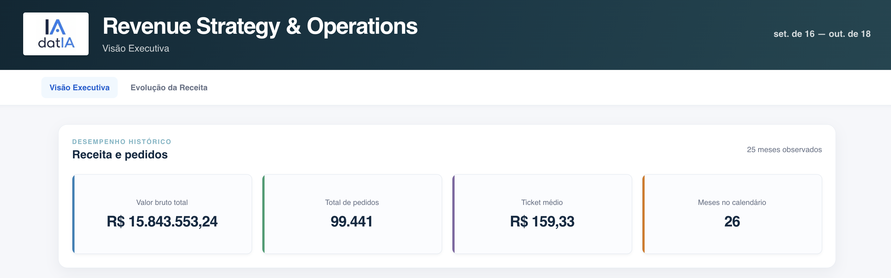

---

#### Base de clientes — Clientes e segmentação

Apresenta:

- clientes únicos;
- segmentos identificados.

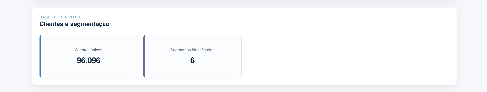

---

#### Estimativa direcional — Projeção de Receita

Apresenta:

- receita total projetada;
- horizonte da projeção;
- modelo utilizado;
- RMSE aproximado;
- gráfico de receita histórica e projetada;
- tabela de detalhes da projeção.

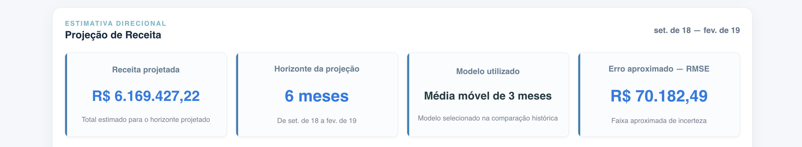

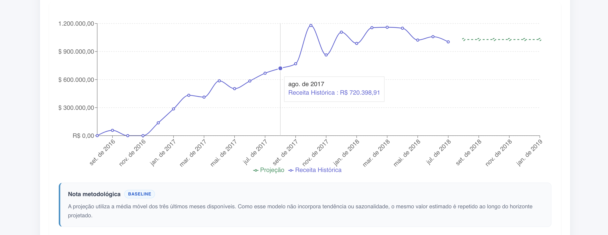

---

#### Como interpretar esta projeção

Explica:

- que o forecast é uma referência direcional;
- que a média móvel não captura tendência;
- que a projeção constante é esperada;
- que o RMSE não é um intervalo de confiança formal.

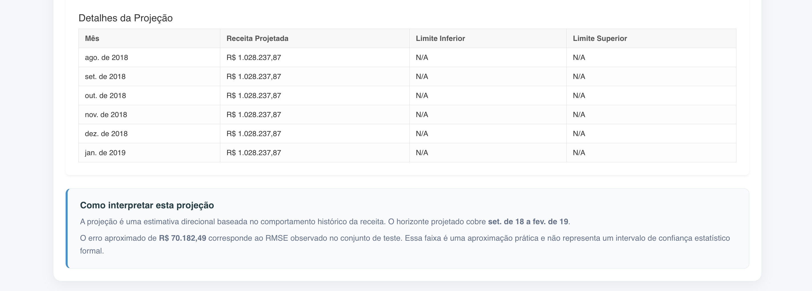

---

#### Contexto analítico — Leitura dos resultados

Organiza a interpretação em:

- base histórica;
- janela de modelagem;
- interpretação do forecast.

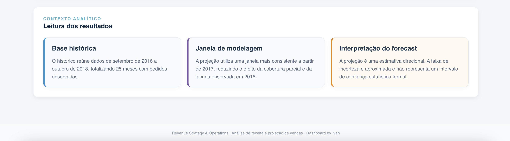

---

### 2️⃣ Página 2 — Evolução da Receita

A página Evolução da Receita apresenta:

- maior receita mensal;
- menor receita mensal;
- crescimento médio mensal;
- receita projetada para o próximo mês;
- gráfico de evolução;
- distinção visual entre histórico e projeção;
- tabela de dados detalhados;
- filtros por tipo de dado;
- filtro dos últimos doze meses.

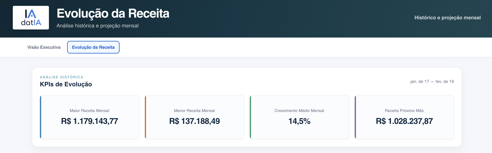

---

O gráfico utiliza:

- linha contínua para receita histórica;
- linha tracejada para receita projetada;
- cores diferentes para facilitar a interpretação;
- tooltip com valores mensais;
- legenda identificando cada série.

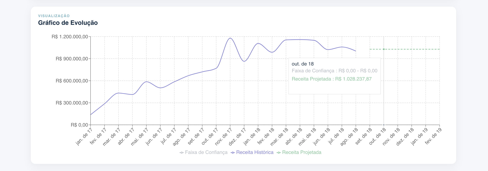

---

### 3️⃣ Detalhes da Projeção

A visualização detalhada permite consultar:

- mês projetado;
- receita estimada;
- tipo de dado;
- limites inferior e superior, quando disponíveis;
- variação mensal;
- modelo utilizado;
- metadados de treinamento e teste.

A tabela foi incluída para permitir uma auditoria rápida entre o gráfico e os
arquivos processados.

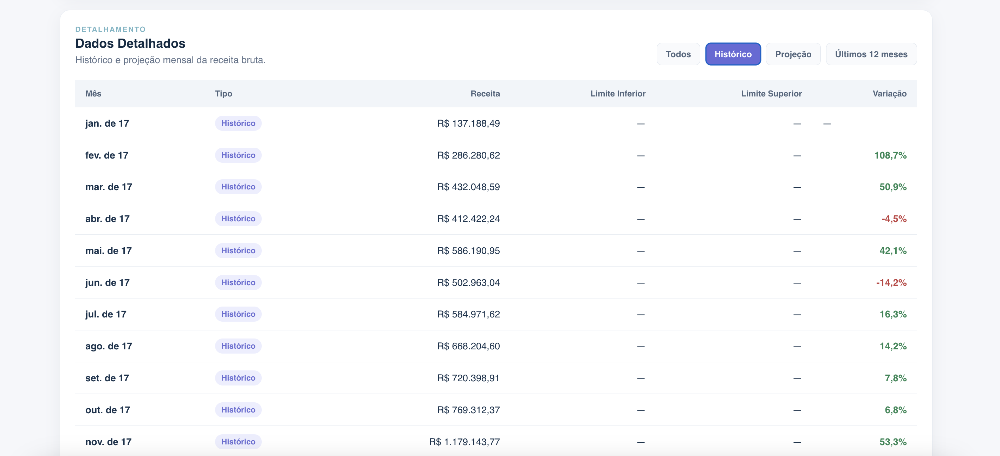
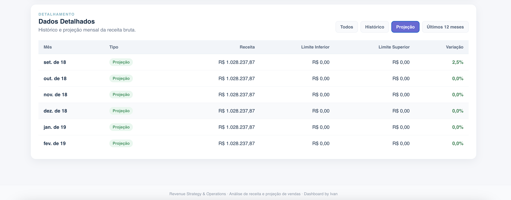
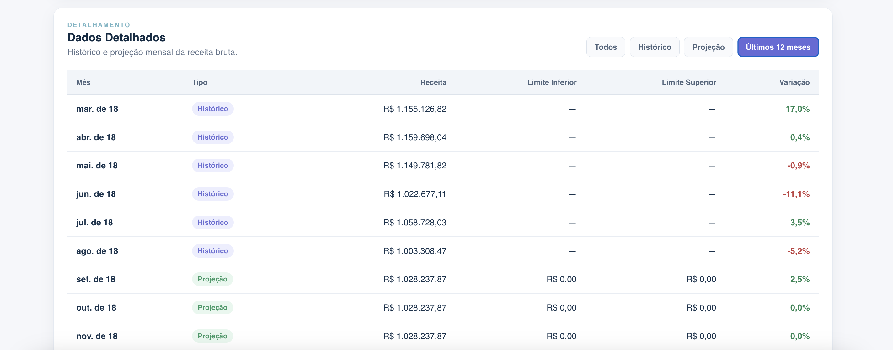

---

## 🧭 Como Executar o Dashboard

No terminal:

```bash
cd dashboard
npm install
npm run dev
```

Acesse:

```text
http://localhost:5173/
```

Rotas disponíveis:

```text
http://localhost:5173/visao-executiva
http://localhost:5173/evolucao-receita
```

Para gerar a versão de produção:

```bash
npm run build
npm run preview
```

---

## 🧪 Validação

Antes de publicar alterações, execute:

```bash
npm run build
```

A validação deve confirmar:

- compilação sem erros;
- carregamento da Visão Executiva;
- carregamento da Evolução da Receita;
- separação entre histórico e projeção;
- ausência de duplicidade em setembro de 2018;
- exibição correta do RMSE;
- funcionamento dos filtros;
- navegação entre as páginas.

---

## 🧱 Estrutura do Repositório

```text
projeto-04-revenue-strategy-operations/
├── README.md
├── data/
│   ├── raw/
│   └── processed/
│       ├── monthly_revenue.csv
│       └── revenue_forecast.csv
├── notebooks/
│   ├── 04_revenue_forecast_model_comparison.ipynb
│   └── 07_dashboard_metrics.ipynb
├── dashboard/
│   ├── public/
│   │   └── data/
│   │       ├── dashboard_summary.json
│   │       ├── monthly_revenue.csv
│   │       └── revenue_forecast.csv
│   ├── src/
│   │   ├── App.jsx
│   │   ├── App.css
│   │   ├── main.jsx
│   │   ├── index.css
│   │   ├── components/
│   │   │   ├── Navigation.jsx
│   │   │   ├── RevenueEvolution.jsx
│   │   │   ├── RevenueForecast.jsx
│   │   │   └── RevenueForecast.css
│   │   └── utils/
│   │       └── formatters.js
│   ├── package.json
│   └── vite.config.js
├── screenshots/
│   ├── 01-visao-executiva.png
│   ├── 02-evolucao-receita.png
│   └── 03-projecao-detalhes.png
└── docs/
    ├── dashboard-public.md
    └── dashboard-internal.md
```

---

## 🛠️ Tecnologias Utilizadas

- **Python**
- **pandas**
- **numpy**
- **Jupyter Notebook**
- **React**
- **Vite**
- **React Router**
- **Recharts**
- **JavaScript**
- **CSS**
- **CSV**
- **JSON**
- **Git/GitHub**

---

## ⚠️ Limitações Conhecidas

O projeto utiliza um baseline simples e não pretende representar um sistema
completo de previsão de receita.

As principais limitações são:

- ausência de sazonalidade explícita;
- ausência de variáveis explicativas;
- ausência de calendário promocional;
- ausência de dados de preço e concorrência;
- ausência de custos e margem;
- ausência de integração com CRM;
- ausência de intervalos de confiança estatísticos formais;
- projeção constante ao longo do horizonte;
- histórico limitado ao período disponível na base.

O forecast deve ser acompanhado por informações comerciais, operacionais e de
mercado antes de ser utilizado em decisões críticas.

---

## 🚀 Próximos Passos

Possíveis evoluções incluem:

- modelos com tendência e sazonalidade;
- regressão com variáveis comerciais;
- análise de elasticidade de preço;
- cenários base, otimista e pessimista;
- análise de margem e rentabilidade;
- segmentação avançada de clientes;
- integração com CRM;
- análise de funil de vendas;
- cálculo de LTV;
- acompanhamento de acurácia ao longo do tempo;
- alertas de desvio entre receita realizada e projetada;
- atualização automatizada dos arquivos processados.

---

## 📈 Relação com Experiência Profissional

Este projeto se conecta a diferentes competências de Revenue Strategy &
Operations:

### Modelagem Preditiva de Receita

Experiência no desenvolvimento de modelos de forecast de receita utilizando
séries temporais e regressão.

### Estratégia de Preços

Experiência com modelos de precificação dinâmica baseados em elasticidade,
custos e concorrência.

### Segmentação de Clientes

Experiência com cluster analysis para segmentação de clientes e personalização
de estratégias de vendas.

### P&L e Rentabilidade

Experiência com análise de rentabilidade por cliente e projeto, identificando
oportunidades de melhoria de ROI.

### Dashboard de Performance Comercial

Experiência no desenvolvimento de dashboards executivos com KPIs comerciais e
operacionais.

### Dados de CRM

Experiência na estruturação de pipelines de dados de CRM para análise de funil
e lifetime value.

### Otimização Baseada em Dados

Experiência com testes A/B para avaliar e otimizar estratégias comerciais.

Os percentuais de **92% de acurácia**, **15% de aumento de margem**, **25% de
aumento de conversão**, **30% de aumento de ROI** e **40% de aumento na
eficácia de campanhas** devem ser associados aos respectivos projetos
profissionais, não apresentados como resultados produzidos diretamente por este
dashboard.

---

## 👤 Autor

**Ivan** — Revenue Strategy & Operations | Project Management & Data Analyst