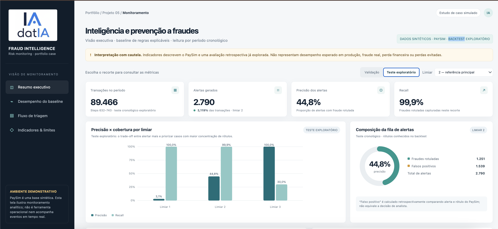
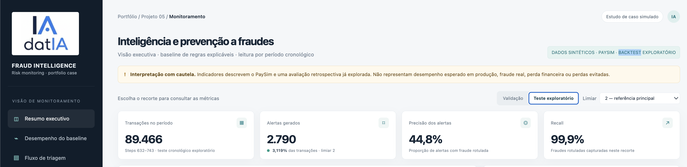
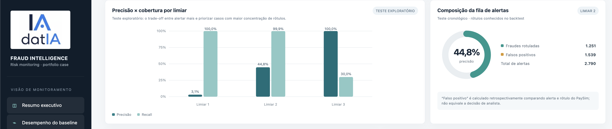
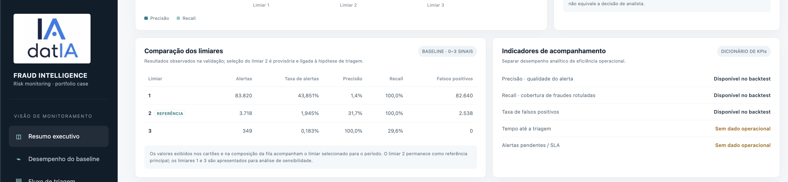
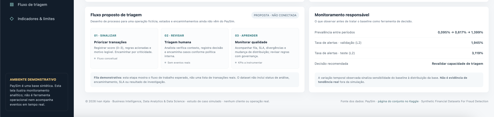

# 🛡️ Projeto 05 — Inteligência e Prevenção a Fraudes

Estudo de caso autoral de portfólio sobre priorização de transações para análise, utilizando a base sintética PaySim. O projeto combina regras explicáveis, avaliação preditiva exploratória, simulação de capacidade operacional e um dashboard interativo para comunicar resultados.

> **Importante:** este projeto é um estudo de caso simulado. Não representa experiência profissional em prevenção a fraudes, dados de uma instituição financeira, uma operação real ou um modelo validado para produção.

---

## 📌 Sobre o Projeto

O projeto simula o desafio de uma empresa fictícia de pagamentos digitais que precisa identificar transações que merecem análise, organizar alertas e comunicar sinais de risco às equipes de Fraude, Operações e Segurança.

A proposta combina análise de dados e contexto operacional para explorar:

- como regras simples e explicáveis podem priorizar transações;
- como o volume de alertas se relaciona com precisão e recall;
- como comparar regras de risco com um modelo preditivo;
- como hipóteses de equipe, tempo de análise e SLA afetam uma fila simulada;
- quais indicadores podem ser calculados com a base e quais exigiriam dados operacionais reais.

O trabalho segue este fluxo:

```text
Base sintética PaySim
        ↓
Inspeção, qualidade e análise exploratória
        ↓
Identificação de padrões descritivos
        ↓
Baseline de regras explicáveis
        ↓
Comparação exploratória com regressão logística
        ↓
Simulação hipotética de triagem
        ↓
Relatório de inteligência e dashboard
```

---

## 🎯 Problema de Negócio Simulado

Uma empresa fictícia de pagamentos digitais deseja organizar transações que merecem análise, priorizar alertas e fornecer informações compreensíveis às equipes responsáveis pela revisão.

O estudo explora perguntas como:

- Quais sinais podem ser combinados em regras simples de priorização?
- Qual é o compromisso entre volume de alertas e cobertura das fraudes rotuladas?
- Como os resultados mudam entre janelas cronológicas?
- Como uma hipótese de capacidade operacional afeta espera e fila?
- Quais conclusões são possíveis com PaySim e quais dependem de dados que a base não contém?

A aplicação a fraudes é demonstrativa. A conexão com minha experiência profissional está nas competências transferíveis de análise, operações, estratégia, priorização e comunicação de indicadores — não em experiência prévia no setor de prevenção a fraudes.

---

## 💼 Conexão com a Experiência Profissional

| Competência em operações e estratégia | Como aparece no projeto |
|---|---|
| Estruturação de problemas | Tradução do cenário de negócio em sinais, regras e perguntas analíticas |
| Priorização de trabalho | Organização de transações em níveis de risco para uma fila conceitual |
| Gestão operacional | Simulação de capacidade, tempos de análise e níveis de serviço hipotéticos |
| Gestão por indicadores | Análise de precisão, recall, falsos positivos, espera e pendências simuladas |
| Comunicação analítica | Relatório e dashboard com resultados, ressalvas e limitações |
| Governança | Separação entre métricas retrospectivas, premissas simuladas e dados indisponíveis |

> O projeto não afirma experiência profissional em fraude. Ele demonstra como conhecimentos de operações, estratégia e análise podem ser aplicados a um novo domínio por meio de um estudo de caso.

---

## 🗃️ Dados Utilizados

O projeto utiliza o conjunto **PaySim — Synthetic Financial Datasets for Fraud Detection**, disponibilizado no Kaggle:

- [PaySim no Kaggle](https://www.kaggle.com/datasets/ealaxi/paysim1)

PaySim é uma base sintética. Seus registros não são transações de clientes reais e não representam uma instituição financeira específica.

A base original não está incluída no repositório. Para executar o projeto:

1. Acesse a página do conjunto de dados no Kaggle.
2. Baixe e extraia o arquivo conforme as instruções da plataforma.
3. Confira os termos de uso vigentes antes de utilizar ou redistribuir dados.
4. Coloque o CSV original em `data/raw/`.
5. Consulte `data/README.md` para as instruções de localização e validação do arquivo.

O projeto não redistribui a base original.

### Limitações dos dados

- `step` é um índice temporal sintético, não uma data de calendário.
- A base não registra decisões de analistas, encaminhamentos ou resultados de investigação.
- Não há horários operacionais reais de criação, início ou encerramento de alertas.
- Não há SLAs observados, custos de operação ou perdas financeiras reais.
- Os rótulos permitem uma avaliação retrospectiva dentro do conjunto sintético, mas não demonstram desempenho em produção.

---

## 🔄 Pipeline Analítico

O projeto está organizado em cinco notebooks:

1. **Inspeção e EDA**  
   Verificação de estrutura, tipos, valores ausentes, duplicatas e distribuição do rótulo.

2. **Padrões de fraude**  
   Análise descritiva de transações por tipo, valor e etapa temporal.

3. **Avaliação das regras de risco**  
   Criação do baseline explicável, avaliação do limiar de referência e análise de sensibilidade.

4. **Simulação da fila operacional**  
   Simulação hipotética de triagem, capacidade, espera, pendências e aderência a SLAs definidos como premissas.

5. **Comparação preditiva**  
   Comparação exploratória entre o baseline de regras e uma regressão logística ponderada.

---

## 🧪 Metodologia

### Divisão cronológica

A base é dividida por `step`, mantendo cada etapa inteira em uma única partição:

| Partição | Intervalo de `step` |
|---|---:|
| Treino | 1–520 |
| Validação | 521–631 |
| Teste exploratório | 632–743 |

A divisão cronológica permite observar diferenças entre períodos. No entanto, a EDA já examinou os rótulos de todas as janelas. Portanto, o teste é um **backtest exploratório**, não um teste cego ou uma avaliação independente.

### Baseline de regras explicáveis

O baseline soma até três sinais e gera um score de risco de **0 a 3**:

1. Tipo de transação `TRANSFER` ou `CASH_OUT`.
2. Valor igual ou superior ao percentil 95 do tipo de transação, calculado no treino.
3. Valor aproximadamente igual ao saldo anterior da conta de origem.

As regras não utilizam `isFraud`, `isFlaggedFraud` nem os saldos posteriores à transação. O limiar **score ≥ 2** é a referência principal do estudo.

Os limiares 1 e 3 são apresentados como análise de sensibilidade; não são políticas operacionais aprovadas.

### Comparação com regressão logística

A comparação utiliza uma regressão logística com ponderação para a classe minoritária. O limiar do modelo é escolhido somente na validação para aproximar o volume de alertas do baseline com score ≥ 2 nessa partição. O mesmo limiar numérico é aplicado ao teste exploratório.

Esse procedimento permite uma comparação sob um volume de referência, mas não define uma capacidade aceitável para uma operação. Os scores do modelo não são probabilidades calibradas.

### Métricas

A avaliação considera:

- volume e taxa de alertas;
- precisão;
- recall;
- F1;
- falsos positivos e falsos negativos;
- Average Precision (AP).

A acurácia não é usada como métrica principal, pois a fraude é uma classe minoritária na base.

---

## 📊 Resultados de Referência — Baseline de Regras

Com score ≥ 2, os resultados documentados foram:

| Período | Transações | Alertas | Taxa de alertas | Precisão | Recall | Falsos positivos | Falsos negativos |
|---|---:|---:|---:|---:|---:|---:|---:|
| Validação | 191.147 | 3.718 | 1,945% | 31,7% | 100,0% | 2.538 | 0 |
| Teste exploratório | 89.466 | 2.790 | 3,119% | 44,8% | 99,9% | 1.539 | 1 |

A prevalência observada aumenta de **0,095% no treino** para **0,617% na validação** e **1,399% no teste exploratório**. Essa variação descreve a base PaySim e não deve ser interpretada como uma tendência de fraude real.

### Análise de sensibilidade dos limiares na validação

| Limiar | Alertas | Taxa de alertas | Precisão | Recall | Interpretação |
|---:|---:|---:|---:|---:|---|
| 1 | 83.820 | 43,851% | 1,4% | 100,0% | Maior cobertura observada, com volume muito elevado de alertas. |
| **2** | **3.718** | **1,945%** | **31,7%** | **100,0%** | **Limiar de referência principal do estudo.** |
| 3 | 349 | 0,183% | 100,0% | 29,6% | Menor volume observado, mas deixa de capturar a maioria dos positivos. |

A precisão de 100% no limiar 3 é um resultado observado nessa amostra; não garante ausência de falsos positivos em outros períodos ou conjuntos de dados.

---

## 🤖 Comparação Exploratória — Regras e Regressão Logística

| Período | Método | Alertas | Taxa de alertas | Precisão | Recall | F1 | AP | Falsos positivos | Falsos negativos |
|---|---|---:|---:|---:|---:|---:|---:|---:|---:|
| Validação | Regras (score ≥ 2) | 3.718 | 1,945% | 31,7% | 100,0% | 48,2% | 0,5193 | 2.538 | 0 |
| Validação | Regressão logística | 3.718 | 1,945% | 20,6% | 64,9% | 31,3% | 0,3983 | 2.952 | 414 |
| Teste exploratório | Regras (score ≥ 2) | 2.790 | 3,119% | 44,8% | 99,9% | 61,9% | 0,6137 | 1.539 | 1 |
| Teste exploratório | Regressão logística | 2.298 | 2,569% | 35,5% | 65,2% | 46,0% | 0,5259 | 1.482 | 436 |

Neste backtest, o baseline de regras apresentou maior recall do que a regressão logística. Isso não demonstra superioridade geral das regras: os resultados dependem da base sintética, das variáveis, do modelo e da forma de seleção do limiar.

A métrica **AP** corresponde a *Average Precision*, calculada com `average_precision_score`.

---

## 🧮 Simulação da Fila Operacional

A simulação utiliza a partição de validação e o limiar 2. Todos os parâmetros são hipóteses editáveis, não observações de uma operação real.

### Premissas do cenário-base

| Elemento | Premissa |
|---|---|
| Equipe | 5 analistas simulados |
| Unidade temporal | 1 `step` mapeado para 60 minutos |
| Chegadas | Distribuídas uniformemente dentro de cada `step` |
| Prioridade | Score 3 = P1; score 2 = P2 |
| Tempo de análise | Distribuição triangular hipotética por prioridade |
| SLA | 15 minutos para P1 e 30 minutos para P2 |
| Semente aleatória | 2026 |

### Resultados do cenário-base

- **3.718 alertas** foram iniciados até o fim do horizonte.
- **3.717 alertas** foram concluídos; um permanecia em análise.
- A espera média estimada foi de **260,89 minutos**.
- A espera mediana estimada foi de **257,69 minutos** e o P90, **516,21 minutos**.
- **20,41%** dos alertas iniciados começaram dentro do SLA hipotético.
- A utilização estimada foi de **89,29%**.

### Sensibilidade à quantidade de analistas

| Analistas simulados | Triados até o fim | Concluídos | Ainda na fila | Espera média | Espera P90 | Início dentro do SLA | Utilização estimada |
|---:|---:|---:|---:|---:|---:|---:|---:|
| 2 | 1.608 | 1.606 | 2.110 | 1.982,36 min | 4.330,51 min | 22,01% | 99,90% |
| 5 | 3.718 | 3.717 | 0 | 260,89 min | 516,21 min | 20,41% | 89,29% |
| 10 | 3.718 | 3.717 | 0 | 33,51 min | 107,58 min | 67,99% | 44,65% |

> **Interpretação:** zero alertas ainda na fila não significa que todos começaram dentro do SLA. Um alerta pode ter sido iniciado depois do prazo hipotético e, ainda assim, concluído até o fim do horizonte simulado.

Os resultados são estimativas condicionadas às premissas de equipe, chegada, prioridade, tempo de análise e SLA. Não representam tempos observados, compromissos de serviço ou recomendação de dimensionamento.

---

## 🖥️ Dashboard Interativo

O dashboard foi desenvolvido em **React e Vite** e apresenta uma visão executiva do baseline de regras. Ele permite consultar as métricas por período e por limiar, além de comunicar os limites do estudo e o fluxo conceitual de triagem.

O painel não está conectado à base em tempo real. Os valores exibidos são resultados documentados do backtest exploratório.

### Visão geral do painel

O cabeçalho apresenta o contexto do estudo, a origem sintética dos dados e um aviso para interpretar os indicadores com cautela. Os controles permitem alternar entre validação e teste exploratório e selecionar um limiar.



### Indicadores do baseline

Os cartões executivos exibem:

- transações no período;
- alertas gerados;
- taxa de alertas;
- precisão;
- recall.

Os indicadores acompanham o período e o limiar selecionados.



### Precisão, recall e composição dos alertas

O gráfico compara precisão e recall entre os limiares 1, 2 e 3. A composição dos alertas apresenta os positivos e falsos positivos conforme os rótulos do PaySim.

“Falso positivo” é calculado retrospectivamente em relação ao rótulo sintético; não equivale a uma decisão de analista.



### Comparação dos limiares

A tabela apresenta alertas, taxa de alertas, precisão, recall e falsos positivos para os três limiares na validação. O limiar 2 é destacado como referência principal, e os demais como análise de sensibilidade.



### Fluxo conceitual de triagem e governança

O painel apresenta um fluxo conceitual em três etapas: sinalizar, revisar e monitorar. Também diferencia indicadores retrospectivos disponíveis na base de métricas operacionais que não podem ser calculadas sem logs reais.



### Escopo atual do dashboard

O painel apresenta:

- resultados do baseline de regras por período e limiar;
- cartões de métricas e visualizações de desempenho;
- fluxo conceitual de triagem;
- indicadores disponíveis e indisponíveis;
- avisos sobre dados sintéticos e limites de interpretação.

O painel **não apresenta atualmente os resultados detalhados da regressão logística nem os valores numéricos da simulação da fila**. Esses resultados estão documentados nos notebooks e neste README.

---

## 🧭 Como Executar o Projeto

### 1. Instalar dependências de Python

A partir da raiz do projeto:

```bash
python -m pip install -r requirements.txt
```

### 2. Obter e posicionar a base

Baixe a base PaySim pela página do Kaggle, confira os termos de uso e coloque o CSV original em `data/raw/`. Consulte `data/README.md`.

### 3. Validar a localização da base

```bash
python -m src.data.prepare_data
```

### 4. Executar os notebooks

```bash
jupyter lab
```

Execute os notebooks na ordem:

```text
01_data_inspection_eda.ipynb
02_fraud_patterns.ipynb
03_risk_rules_evaluation.ipynb
04_operational_queue_simulation.ipynb
05_predictive_model_comparison.ipynb
```

O notebook 05 opera sobre uma base com milhões de registros e pode exigir recursos computacionais consideráveis.

### 5. Executar o dashboard

O dashboard é uma aplicação React/Vite. A partir da pasta `dashboard/`, instale as dependências e inicie o ambiente de desenvolvimento:

```bash
cd dashboard
npm install
npm run dev
```

Para gerar a versão de produção:

```bash
npm run build
```

Os comandos dependem da configuração presente em `dashboard/package.json`. Para publicar a aplicação, confira também a configuração de base path do Vite e os caminhos de carregamento dos arquivos estáticos.

---

## 📁 Estrutura do Repositório

```text
projeto-05-fraud-intelligence/
├── README.md
├── requirements.txt
├── .gitignore
├── data/
│   ├── raw/                              # CSV original PaySim; não incluído
│   ├── processed/                        # Resultados gerados localmente
│   └── README.md                         # Fonte e instruções dos dados
├── notebooks/
│   ├── 01_data_inspection_eda.ipynb
│   ├── 02_fraud_patterns.ipynb
│   ├── 03_risk_rules_evaluation.ipynb
│   ├── 04_operational_queue_simulation.ipynb
│   └── 05_predictive_model_comparison.ipynb
├── src/
│   ├── data/
│   │   └── prepare_data.py
│   └── analysis/
│       ├── risk_rules.py
│       └── queue_simulation.py
├── reports/
│   ├── figures/
│   └── intelligence_report.md
├── dashboard/
│   ├── public/
│   │   └── ia-datia-logo.png
│   ├── src/
│   │   └── App.jsx
│   └── ...
└── screenshots/
    ├── 01-dashboard-visao-geral.png
    ├── 02-dashboard-indicadores.png
    ├── 03-dashboard-desempenho.png
    ├── 04-dashboard-comparacao-limiares.png
    └── 05-dashboard-triagem-governanca.png
```

A estrutura acima representa os principais arquivos do projeto. Ajuste os nomes ou caminhos conforme a organização final do repositório.

---

## 🛠️ Tecnologias Utilizadas

- **Python**
- **Pandas**
- **NumPy**
- **Matplotlib**
- **Scikit-learn**
- **Jupyter Notebook**
- **React**
- **Vite**
- **JavaScript**
- **HTML e CSS**
- **Git e GitHub**

---

## ⚠️ Limitações e Uso Responsável

- PaySim é uma base sintética e não contém transações reais.
- `step` é um índice temporal sintético, sem interpretação como data de calendário.
- As associações encontradas são descritivas; não demonstram causalidade.
- A EDA examinou os rótulos de todos os períodos. Por isso, o teste cronológico é exploratório, não cego ou independente.
- A base não contém decisões de analistas, encaminhamentos, tempos de triagem, pendências reais, SLAs observados ou perdas financeiras.
- As métricas preditivas são retrospectivas em relação aos rótulos do PaySim.
- Os indicadores operacionais da fila são estimativas condicionadas às premissas da simulação.
- A comparação não comprova superioridade geral de regras ou modelo.
- O projeto não estima perdas evitadas nem demonstra eficácia operacional.

Para uma avaliação confirmatória, seria necessário reservar uma janela futura ainda não examinada e definir previamente as variáveis, o método, o limiar e as métricas.

---

## 🚀 Próximos Passos

- Adicionar capturas atualizadas do dashboard à pasta `screenshots/`.
- Manter README, dashboard e resultados dos notebooks sincronizados.
- Executar os notebooks em ambiente local e revisar os outputs antes da publicação.
- Realizar análise de sensibilidade mais ampla das premissas da fila.
- Considerar uma janela temporal futura realmente não examinada para uma avaliação confirmatória, caso haja dados adequados.
- Incorporar métricas operacionais reais somente se houver acesso autorizado a logs e documentação da origem dos dados.

---

## 📄 Relatório Detalhado

Consulte [`reports/intelligence_report.md`](reports/intelligence_report.md) para ver os resultados completos, as premissas da simulação, a comparação preditiva e as limitações metodológicas.

---

## 👤 Autor

**Ivan Ajala**  
Business Intelligence · Data Analytics · Data Science

- **LinkedIn:** [Ivan Ajala](https://linkedin.com/in/ivan-ajala)
- **GitHub:** [Ivan Ajala](https://github.com/ivan-ajala)

---

**Projeto autoral de portfólio · estudo de caso simulado · dados sintéticos PaySim**